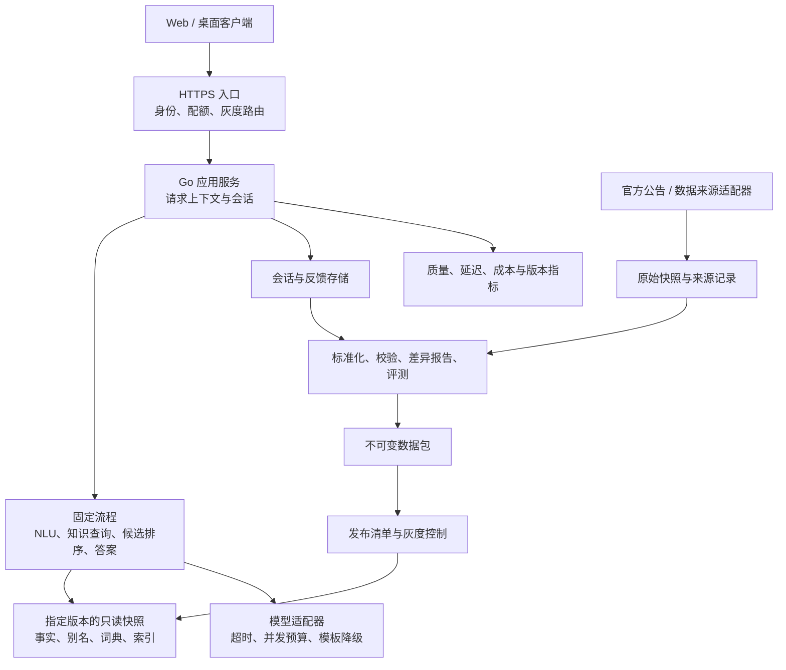

**TFT Copilot：dev 产品成熟度与架构演进评估**

落地执行与进度以 [2026-09-08 交付计划](DELIVERY_PLAN.md)为准；该计划包含架构约束、逐项任务卡和 dev 验收流程。本文保留评估时点的代码事实。

评估日期：2026-09-07，第二次评估。已执行 `git fetch origin` 并将本地 `dev` 从 `2464101` 快进至 `d988472`，与本次获取的 `origin/dev` 一致。新增提交为“数据升级至 TFTSet18：修复 assetNames 中文映射 + 新增 18.1 官方公告 + 部署脚本”。工作区三个前端文件的未提交修改保留，前端结论按 dev 已提交内容核对。本次拉取远端代码与数据，并修订评估文档；未另行修复业务代码、重新抓取游戏数据或部署服务器。

**更新复核：哪些旧结论需要修正**

| 上次评估点 | 最新 dev 状态 | 修订结论 |
| --- | --- | --- |
| 仓库仍为 TFTSet17、趋势截至 7 月 29 日 | 已升级 TFTSet18，趋势截至 9 月 1 日，增加 18.1 公告 | 旧数据盘点结论撤回，以本文第 3 节为准；仍缺精确 patch/热修与数据批次绑定 |
| 新赛季中文 ID 适配 | 新增 `assetNames` 桥接，阵容中 63 个不同单位 ID 均能正向译为中文 | 明确改善；反向映射仍有多形态同名覆盖问题，见下文伊莉丝案例 |
| 服务器部署方便性 | 新增 `deploy/deploy.sh`，整合上传、安装、外部健康检查 | 操作入口增加；固定旧包名、PORT 语义及失败退出仍需修复，不等于版本化发布 |
| 模型服务可配置性 | Ark 新增 `ARK_BASE_URL` 环境变量读取 | 代码已支持自定义端点；本次未验证真实模型接口，Compose 配置未随之修改 |
| 强数据校验、完整快照与安全 Reload | 对应实现无变化 | 上次问题仍成立 |
| 身份/成本治理、健康探针、反馈持久化、SSE 版本证据、CI 数据门禁 | 对应实现无变化 | 上次问题仍成立 |
| Go 测试通过 | 最新数据下全量测试失败，两个子用例仍假定金克丝存在 | 上次“Go 测试通过”不再适用于当前提交；不能宣称已经通过发布验收 |

新提交主要完成了一次赛季数据迁移和操作脚本补充，未实现独立数据发布、灰度路由与回滚系统。整体阶段仍为工程化 MVP 向可运营内测过渡；数据内容有进步，发布可靠性尚无实质升级。当前应先恢复测试门禁、解决 ID 适配和部署脚本缺陷，再启动快照/灰度改造。

**最新提交的具体问题与验证**

1. **[P1] 新部署脚本写死旧包名，无法复用正常新产物。** [deploy.sh:11](../deploy/deploy.sh#L11) 固定使用 `dist/tft-copilot-v0.0.0-dev-20260901.tar.gz`，而 build-release 按当前日期和版本生成包。新执行 `make release` 不会自然产生该固定路径；目录留有旧包时，也可能继续上传旧产物。应显式接收包路径或消费构建步骤返回的精确产物清单，并统一现有 publish/deploy 两个入口。
2. **[P1] 外部健康检查失败仍返回成功。** [deploy.sh:51](../deploy/deploy.sh#L51) 在 curl 失败分支只打印排查建议，随后无条件打印“部署完成”。本次在临时目录替换 scp/ssh/curl/sleep/tee 为本地桩：模拟上传安装成功、外部健康检查失败，实际退出码仍为 0。应返回非零、报告失败状态，并按发布策略决定回滚；外部不可达本身不应被解释为服务正常或服务一定崩溃。
3. **[P1] 中文反向映射仍会丢失底层英雄检索命中。** [localization.json:856](../metadata/tft-meta/data/localization.json#L856) 将“伊莉丝”映射到 `TFT18_EliseSpider`，而有效阵容使用 `DA_18_Elise`。实测 Store 解析后的 ID 命中 0 套，直接按实际 ID 命中 1 套。`UnifiedStore.QueryNLU` 的中文 Meta 补充逻辑还能返回 2 套，所以不能把此缺陷描述为主接口对伊莉丝完全无结果；问题是底层与补充链路不一致，回退还会带入一套 137 样本、原本被基础推荐过滤的阵容。应为同名多形态实体选择统一规范 ID，校验正反向关联，并统一低样本处理。
4. **[P1] 赛季数据与现有测试未同步。** [nlu_data_query_test.go:47](../tft/agent/nlu_data_query_test.go#L47) 读取生产数据，却固定断言“金克丝”能命中阵容。最新数据已无该单位，`只有英雄`、`英雄+装备` 两个子用例失败。应将查询逻辑单测改为固定 fixture，另设当前赛季数据契约测试；不能通过删掉断言或降低门禁解决。
5. **[P2] 抓取失败路径出现新异常。** [get_tftmeta_cn.py:519](../metadata/tft-meta/get_tftmeta_cn.py#L519) 在 `if not raw_data` 之前调用 `raw_data.get(...)`。使用真实 run 方法、模拟源返回 None，得到 `AttributeError`。应先判断源响应，再解析字段，并加入失败/缺字段的适配测试。本例会中止流水线，不代表它已经把坏数据发布出去。

部署脚本另有两处使用体验问题：`PORT` 仅改变本地外部健康检查端口，没有传递为服务器服务配置；个人 Python 绝对路径缺失时虽有 `cat` 回退，但该路径不应进入通用部署工具。脚本注释声称“原子替换二进制+数据”，而 install.sh 实际只原子替换二进制，数据仍先删除再复制。以上均未在本次评估中直接修复。

**1. 产品判断**

当前处于“具备单机交付基础的工程化 MVP，向可运营内测版过渡”。核心知识问答链路已经成立，但还没有足够证据证明版本准确性、发布可靠性、多实例一致性和实际用户价值。最新提交的自动测试尚未全过，应先修复上述门禁问题，再作为受控内测候选；公开运营前仍需补数据发布与服务治理。

评价尺度为：L1 概念演示、L2 工程化 MVP、L3 可运营内测、L4 稳定产品、L5 可规模化平台。当前整体约 L2–L3，属于产品与工程判断，不是测试通过率或完成百分比。

| 维度 | 当前证据 | 判断与下一道门槛 |
| --- | --- | --- |
| 基础问答 | 阵容、英雄、装备、羁绊、别名、版本公告；Fast NLU + 确定性检索 + LLM 整理 | L3 的功能基础；需要当前补丁准确性和问题覆盖率验证 |
| 产品体验 | Web 会话历史、SSE、取消、局面快填、Wails 入口 | MVP 已成形；需要可信数据标识、结构化结果和显式反馈 |
| 教练能力 | 文本阶段/金币/等级/血量解析、Prompt 策略提示、上一轮反馈 | L2；尚非完整状态模型、可验证决策引擎或长期学习系统 |
| 数据治理 | MetaTFT 更新脚本、OP.GG MCP 导入入口、JSON 知识库、部分元信息 | L2；精确 patch、完整数据包、一致性与回滚缺位 |
| 工程交付 | contracts、依赖注入、单测、PR 检查、Docker、systemd、发布脚本 | L3 的基础；产物、检查和发布闭环需要统一 |
| 运营与扩容 | 健康接口、可选 IP 限流、日志、JSONL 反馈 | L2；身份/额度、持久状态、质量指标、告警和灰度缺位 |

已有投入值得保留：`agent` 负责流程，`knowledge` 负责事实，`contracts` 负责边界；Fast NLU 减少不必要的模型调用；反馈收集和回放为后续质量闭环预留了接口。当前瓶颈集中在“事实是否适用于这次查询”和“变化能否安全发布”，继续堆 Prompt 很难解决。

首个稳定产品建议聚焦“可信的版本攻略、赛前学习和赛后复盘”：服务希望减少查资料成本、理解阵容与装备取舍的玩家。暂时不要用胜率提升或上分段作为已验证卖点。北极星指标可设为“每周完成一次有依据、被用户确认有帮助的学习/查询会话的用户数”，同时观察回访率、事实错误率和每次有效回答成本。

公开产品路线还需修订 ADR011 的适用场景。Riot 公开 TFT 政策把动态局内建议、直接替玩家作决策和对手棋盘侦察列为受限制或不批准方向；鼓励赛前知识与赛后学习。自动棋盘识别、对手侦察、动作级指导不能只作为工程复杂度问题排期，应优先用于复盘/训练，并核对目标市场规则与准入要求。这不是本次评估对项目是否已获批准的判断。[Riot TFT 产品政策](https://developer.riotgames.com/docs/tft#game-policy)

**2. 关键代码发现与优先级**

这里的 P0 表示公开运营或启用自动数据发布前应完成；P1 是建立内测运营闭环；P2 是验证使用量后再投入。

| 优先级 | 发现与代码依据 | 用户或运维影响 | 建议 |
| --- | --- | --- | --- |
| P0 | `make data-check` 只验证文件/目录存在，不解析 JSON、不判断内容非空；见 [Makefile](../Makefile) | 空文件也能显示“数据完整”，无法担当发布门禁 | 加严格验证器：schema、数量、关联、补丁/来源一致性、内容哈希、业务查询 |
| P0 | `Reload()` 在 knowledge 失败时保留旧知识，同时替换新 metadata；尚未接入生产发布触发和版本选择；见 [unified_store.go:555](../tft/knowledge/unified_store.go#L555) | 可能出现新旧数据混用，而且调用返回成功；有方法不等于已具备灰度系统 | 新包全部预加载并验证；任一必需部分失败，整包拒绝 |
| P0 | Fast NLU 词典在建图时构建；别名路径写死。Reload 的默认 knowledge 路径也未沿用 `GetKnowledgeDir()`；见 [fast_nlu.go:25](../tft/agent/fast_nlu.go#L25)、[graph.go:309](../tft/agent/graph.go#L309) | 外挂新数据后，检索、词典、别名可能属于不同版本 | 统一配置入口，把词典、别名与所有查询索引归入同一快照 |
| P0 | `/health` 只读取 Handler 保存的原始 `data.Store` 阵容数；启动时 knowledge 加载失败允许降级；见 [handler.go:452](../tft/handler.go#L452)、[knowledge_runtime.go:11](../tft/agent/knowledge_runtime.go#L11) | 当前基础 Store 为 26 套，完整知识为 53 套；非零数量不能证明知识完整、当前版本或正在服务的快照正确 | 分离存活和就绪；就绪检查实际运行快照与支持能力 |
| P0 | 更新脚本先清空目标 JSON，再逐个生成；安装脚本删除旧数据目录再复制、重启，无自动回滚；见 [update_cn_knowledge.py:280](../scripts/update_cn_knowledge.py#L280)、[install.sh:31](../deploy/install.sh#L31) | 生成/复制失败可留下不完整磁盘状态；升级失败恢复依赖人工 | 生成至新目录；不可变版本目录；预检、切换与回滚分步执行 |
| P0 | 已提交前端把 `marked.parse()` 的 HTML 直接交给 `innerHTML`；见 dev 的 [app.js](../frontend/assets/app.js) | 模型或知识输出带危险 HTML 时存在 XSS 风险 | 统一 HTML 清洗，限制链接协议，配合 CSP；覆盖流式和历史重放两条路径 |
| P0 | 请求入口没有鉴权、请求体/文本额度和全局模型并发预算；IP 限流默认关闭；见 [main.go:54](../main.go#L54)、[ratelimit.go:90](../tft/ratelimit.go#L90) | 公网入口可能持续消耗 LLM 配额；IP RPS 不能约束长请求并发 | 内测访问凭证、用户额度、请求长度限制、模型并发上限与熔断；配置可信代理 |
| P1 | `FeedbackMemory` 是进程内 map，30 分钟 TTL，只记上一轮；session ID 来自客户端；见 [feedback.go:46](../tft/agent/feedback.go#L46) | 重启/换实例丢上下文；有 session 隔离不等于有身份授权 | 绑定用户与会话，限定容量；扩多实例前共享状态或明确会话重置行为 |
| P1 | 反馈默认写 `data/feedback_cases.jsonl`，Docker 使用非 root、未创建可写状态目录，也没有持久卷；见 [feedback.go:216](../tft/agent/feedback.go#L216)、[Dockerfile](../Dockerfile) | 按默认镜像布局推断，反馈写入会遇到权限问题；重建容器也没有持久化保证 | 设置可写状态目录与属主，挂载卷；反馈落库或集中收集，加入写失败指标 |
| P1 | 回放规则主要检查非空与“不重复旧答案”，未接入 CI；见 [replay-eval-design.md](replay-eval-design.md) | 换一种说法仍然可能错；demo 通过不能当事实正确率 | 固定证据的事实评测、拒答评测、真实 SSE 多轮回放，再辅以人工/模型评审 |
| P1 | PR、GitFlow、Release 检查口径不统一；GitFlow 排除 agent，正式 Release 会测 agent；新部署包脚本未接入 Release，CI 主要上传裸 server 二进制 | 下载裸二进制不包含运行时游戏数据；本地包与 CI 交付物可能不同 | CI 统一入口，独立 server release，输出镜像、完整离线包、校验和及发布元信息 |

关于前端，Marked 官方明确说明其输出不自带 HTML 清洗，本项是具体渲染路径产生的风险。[Marked 安全文档](https://marked.js.org/#usage)

还有几个值得随 P1 处理的工程细节：

- `UnifiedStore` 禁用自身日志时修改了 `logrus.StandardLogger()` 的全局等级，而 NLU/knowledge 阶段日志使用全局 logger，可能让部分指标日志消失；改为独立注入 logger。依据：[unified_store.go:32](../tft/knowledge/unified_store.go#L32)、[graph.go:407](../tft/agent/graph.go#L407)。
- SSE 推送结构目前主要是 token/error/done，没有稳定的数据版本与证据事件。新增 metadata/evidence/answer/done 协议，使 UI 和日志都知道本次回答用了哪份事实。
- JSON `/nlu` 当前只回传解析后的 Context，SSE 才提供完整润色回答；两个接口的用途与返回契约应明确，复用统一应用服务后由传输适配器编码。
- systemd 服务没有 `User=`，默认按 root 运行；应创建独立服务用户，代码/数据只读，状态目录单独授权。
- HTTP 服务器缺少请求头/空闲超时；同步请求使用独立 context，客户端断开仍会继续推理；应配合 SSE 的长连接特征分别设置，避免用短的全局 WriteTimeout 截断正常流。
- 当前 10 秒退出窗口与最长模型请求时间不一致；发布时先摘流、等待在途 SSE 排空，并核实 `Shutdown` 完成再退出主进程，超时请求提供可解释的恢复行为。

**3. 数据现状：版本可信度是最紧迫的产品问题**

本次读取的工作树游戏数据未发生未提交修改，盘点结果如下：

| 项目 | 实际内容 |
| --- | --- |
| 完整阵容数据 | 53 套，`TFTSet18` |
| 基础 Agent Store 阵容 | 26 套；另 27 套因样本数小于 200 被生成脚本过滤，数量差异本身不是丢文件 |
| 英雄/装备拆分文件 | 64 / 39；为生成记录数，不等同于已验证的可购买棋子总数 |
| 单位 ID 中文覆盖 | 完整阵容中 63 个不同单位 ID，均存在正向中文映射；伊莉丝反向映射有冲突 |
| 英雄画像生成时间 | 2026-09-01T14:17:46+0800 |
| 阵容趋势日期范围 | 2026-08-26 至 2026-09-01 |
| 版本公告 | 17.1（4 月 15 日）、17.7（7 月 15 日）、18.1（8 月 26 日） |
| 阵容 early/middle 计划 | 当前 53 套数据中为 0；contracts 支持不代表数据已具备 |
| 独立羁绊文件 | 1 个 `astral.json`，其中 version 为 `S11` |

单独的羁绊文件数不代表只能查一种羁绊，代码也会从阵容提取羁绊。但 `S11` 文件仍与新的 `TFTSet18` 数据同目录，是缺少赛季隔离的明确迹象；不能仅因它能够加载就默认它适用于当前查询。旧 17.x 公告也仍然被加载，且查询未按请求版本过滤。

本地还残留被 Git 忽略的 Set17 `comps_full_cn.json` / `comps_for_agent_cn.json` 中间文件。这些不属于新提交，当前 Go 主链路也不读取它们，不能据此声称远端主数据仍是 Set17。但部署包复制整个 metadata 目录时会夹带这些本机文件，说明产物应按显式清单构建，避免开发环境残留进入交付物。

已有 `KnowledgeMetadata` 的 source/version/updated_at/sample_count 能继续复用，但它的 version 往往来自赛季，updated_at 可由趋势日期推导，没有构成“精确游戏补丁 + 数据生成批次 + 抓取时间 + 统计口径”的完整证明。阵容 Count 已存在；需保留逐条样本量，避免把不同阵容 Count 相加后误称为去重对局数。

公告查询按发布时间和相关性扫描多份公告，没有以本次请求的精确 patch 限制范围。已有新公告不等于统计数据已经更新；旧公告还可能再次进入上下文。应为事实设置适用版本/有效期，并把跨版本对比作为显式查询模式。

本报告不猜测这份数据对应的精确线上补丁，也不把赛季 ID 当成 patch。发布器必须从经核对的源记录生成版本清单。Riot 官方也说明 Data Dragon 不一定在补丁发布后立即更新，因此不能用“拉取成功”或“抓取日期是今天”推导“数据已覆盖今天的补丁”。[Riot 数据更新说明](https://developer.riotgames.com/docs/tft#data-dragon)

**4. 近期产品优化：让用户看得懂可信度，并能完成任务**

| 场景 | 产品变化 | 验收方法 |
| --- | --- | --- |
| 查询版本阵容 | 显示适用赛季/补丁、统计更新时间、来源、段位/模式口径和样本量；先给 2–3 个候选及取舍 | 玩家无需追问就知道建议适用范围；版本缺失时不展示“当前最强” |
| 装备/英雄/羁绊学习 | 结构化卡片呈现关键数据、适配对象、条件与证据；详细解释按需展开 | 检索证据与卡片一一对应，禁止模型生成无来源统计 |
| 新补丁首日 | 独立展示“基础事实已更新 / 统计积累中”；弱化排名承诺，列出明确已知改动 | 缺统计时仍可查新规则，同时不使用上一补丁排名冒充当前推荐 |
| 多轮学习/复盘 | 显式保存目标阵容、已确认条件、证据版本与缺失信息；从上一轮自然语言摘要升级为结构化状态 | “这套装备怎么给”等追问能指向正确对象；会话失效时明确提示 |
| 反馈 | 有帮助/事实错误/过期/答非所问/信息不够等快捷入口，记录 trace 和版本 | 用户继续追问不被直接算成满意；反馈可关联到具体版本进行复盘 |
| 低延迟查询 | 高频高置信场景先返回确定性卡片/模板，模型补充解释；低置信时提出最少必要澄清 | 分别记录首次有用信息时间、首 token 时间和整体完成时间 |

事实、统计结论与教练经验应在数据结构和显示层分开。经验可以作为学习建议，但不应伪装成精确概率、伤害数值或“版本最优解”。先验证纯文本复盘与静态策略比较的用户价值，再增加图片输入。

**5. 推荐架构：模块化单体 + 离线数据发布系统**

以当前数据规模和团队未知的前提，建议继续使用 Go 单体与内存确定性索引。暂时没有测量证据支持把查询拆成微服务，或引入向量数据库、Kafka、Kubernetes。保留接口边界，让部署拓扑按需要演进。



图中的模块是职责划分，不要求每个模块成为独立进程。第一期部署为“反向代理 + 两个相同应用镜像的实例 + 只读数据包 + 持久状态”。双实例用于发布和数据灰度；数据生产放在 CI 或独立批处理进程。

建议先新增的边界：

| 边界 | 负责什么 | 对应现有实现 |
| --- | --- | --- |
| `AppService` | 统一 HTTP/SSE/桌面的请求生命周期、授权、上下文和输出 | 从 Handler/Agent 中提取共享应用服务 |
| `SnapshotProvider` | 按 release ID 获取完整只读数据与词典；检查兼容性 | 改造 `knowledge_runtime`、`UnifiedStore`、Fast NLU 初始化 |
| `SessionStore` | 用户与会话绑定、会话版本、上下文、过期/并发控制 | 替换进程 map 的存储依赖 |
| `FeedbackRepository` | 保存结构化反馈与版本、支持评测回流 | 演进 JSONL 追加逻辑 |
| `ReleaseRegistry` | 管理候选/稳定/撤回状态、分桶策略、审计历史 | 新增发布控制模块 |
| `DecisionPolicy` | 面向学习/复盘的规则、候选与缺失信息；可单独测试 | 从 `prompt_decision.go` 提取，LLM 负责表达 |

`contracts` 继续作为共享边界。进程内可以逐步使用类型化请求/响应，把 JSON 编解码放到 HTTP/MCP 适配器，减少重复序列化与转换代码；MCP 继续作为工具对接能力，不必成为线上问答必经的网络调用。

`data.Store` 与 `knowledge.Store` 当前是查询类型/索引的双轨，不能简单描述为“同一 metadata 被加载了两份”。近期先保证两者属于同一快照；legacy 下线后再合并实体和重复查询。迁移以主链路输出兼容为门槛。

持久存储按需求分期：单实例验证可使用独立状态卷中的 SQLite；开始双实例灰度且要求不中断多轮时，应先引入共享状态，建议以 PostgreSQL 保存会话、反馈和发布记录。Redis 仅在会话吞吐、集中额度或缓存压力有测量依据时增加。对象存储只存原始快照与不可变数据制品；应用使用本地只读副本查询。

**6. 服务器部署：从“能一键装”升级为“可重复发布、失败可恢复”**

当前已经有 `make compose-up`、`make publish SERVER=user@host`，以及新增的 `deploy/deploy.sh`。publish 会在开发机编译、上传、远端安装，首次仍需 SSH/sudo 条件和模型配置；新 deploy 脚本依赖固定旧包路径，尚不能替代通用发布流程。近期应统一这些入口的产物选择、配置契约和失败行为，再补发布事务。

建议把 Docker Compose 定为标准服务器交付，systemd 完整离线包作为可选方案，二者消费同一份发布清单。Docker 官方支持针对单机生产环境增加独立 Compose 配置；普通重建服务会替换容器，流量切换与业务回滚需要本项目另外实现。[Docker 生产部署说明](https://docs.docker.com/compose/how-tos/production/)

目标流程：

1. CI 对确定提交执行统一代码/数据校验，构建 linux/amd64、linux/arm64 应用镜像和完整离线包。发布使用不可变镜像 digest，版本标记包含 commit，避免依赖可覆盖的 `latest` 或同一天的同名 tar 包。
2. 应用镜像包含程序与静态前端；生产游戏数据从指定 release 包只读挂载。代码和数据独立发布，但由统一清单绑定兼容组合。离线包可以附带已验证数据与安装资产，开箱运行。
3. 服务器首次配置目录、凭证、HTTPS、状态存储和代理。后续只拉取指定产物，无需 Go/Python 编译环境。模型凭证保留在服务器受限配置中。
4. 在空闲槽启动新实例，加载确定的数据包、预热词典和索引。执行 readiness、版本比对及确定性业务冒烟；必要时独立执行少量 LLM 合成请求。
5. 先小流量后全量。旧实例停止接收新请求，保留已有 SSE，等待排空。代理关闭 SSE 缓冲，配置心跳与读超时；客户端能够识别中断而不是显示为成功结束。
6. 失败时恢复旧流量策略和兼容的发布清单；保留旧镜像/数据包。校验进程健康、实际返回的 release ID 和基本查询，不以 HTTP 200 或字符串包含 `comp_count` 判定发布成功。

建议清单至少记录：`app_image_digest`、`app_version`、`git_commit`、`data_release_id`、`schema_version`、`prompt_version`、`policy_version`、`model_config_version`、`deployment_id`。这些都应该能从请求日志追溯。

单机双实例只能改善发布连续性，主机故障仍会停服。需要主机级高可用时，再扩为跨主机实例、外部负载均衡和共享状态；需要大量服务和独立扩缩容时再评估 Kubernetes。

systemd 方案也应采用相同机制：版本化程序目录与数据目录、受限服务用户、独立状态目录；单进程切链接后重启会有中断，需要无中断时使用两个端口的服务实例与代理。不要把切换磁盘软链接等同于已更新内存数据。

**7. 游戏数据灰度：完整设计**

**7.1 先区分三种变化**

| 变化 | 发布对象 | 正确方式 |
| --- | --- | --- |
| 应用修复/功能升级 | 应用版本 A → B，数据可不变 | 蓝绿或应用灰度，验证旧/新应用对相同数据 schema 的兼容性 |
| 同一补丁数据修订 | 同一 game patch 下的 r1 → r2，例如更多统计样本、别名纠正 | 两包并存，按会话固定分桶，逐步放量，可回到 r1 |
| 游戏补丁/赛季切换 | game patch P → P+1，甚至实体/规则发生变化 | 按地区、模式、生效时间选择正确游戏版本；旧版本仅用于历史查询；在新补丁范围内灰度数据修订 |

核心约束：游戏已更新时，不能为了做 5% 灰度，让剩余 95% 用户仍拿旧规则当“当前版本”。新补丁先发布经验证的基础事实包，统计不成熟就显式标记积累中；之后再灰度新的统计包。严重热修同理：先处理事实有效性，不能把已知错误延长为正常对照组。

代码回滚与数据回滚也不能简单一起倒退：旧应用必须能读取当前有效补丁的数据。没有同补丁、已验证的可回退包时，进入基础事实/缺失统计的降级模式，而不是回到上一补丁继续推荐。

**7.2 数据版本清单和不可变包**

每次构建产生唯一 `data_release_id`，记录输入文件校验和、规范化代码提交和所有转换参数。重试同一输入应得到相同内容或可解释的构建差异；候选构建互不覆盖。示意目录如下，不是已实现命令：

```text
data-releases/
  <release-id>/
    manifest.json
    metadata/
    knowledge/
    checksums.sha256
    validation-report.json
    eval-report.json
channels/
  <region>-<queue>-<patch>.json
```

manifest 必需信息：

- 身份与兼容性：release ID、game ID、set ID、game patch、hotfix revision、schema version、应用读取兼容范围。
- 适用范围：游戏服务地区、模式/queue、语言、地区补丁生效时间；语言为中文不代表统计来自国服。
- 来源：每个事实/统计源的 URL 或数据集 ID、源版本、抓取时间、内容哈希。人工别名与攻略同样记录提交、适用赛季和审核状态。
- 统计口径：来源地区、段位范围、统计窗口起止、每条样本量、指标定义；不知道的字段明确标 unknown，不用推断值填充。
- 完整性：全部文件路径/哈希、实体数量、必需与可选能力列表、上游原始快照定位、构建器提交。
- 发布证据：差异报告、验证结果、评测报告、构建时间与发布记录。

至少区分 `fetched_at`、`stats_window_end`、`game_patch_effective_at` 和 `built_at`。读取最新公告不改变统计数据的有效补丁；从旧缓存再生成一次也不能刷新统计新鲜度。

**7.3 构建与校验流程**

1. 检测官方更新或运营触发，明确目标地区、模式和 patch，创建发布任务；爬虫不直接改生产目录。
2. 通过 MetaTFT/OP.GG/官方公告等各自适配器抓取原始快照，记录源版本、内容哈希；源不可用时有界重试，失败不会发布。现有脚本的 `--metadata-dir` / `--knowledge-dir` 可以复用来写候选目录。
3. 转成统一实体模型，以稳定 ID 关联中文名称和别名。不同来源 cluster ID 不能默认可连接；明确命名空间或映射规则。跨赛季沿用装备等合法实体应有明确规则，不能只用 ID 前缀粗暴判断。
4. 基础校验：文件非空、JSON/schema、数量阈值、唯一 ID、引用完整、金额/费用/星级/概率范围和统计字段语义；大规模数量变化必须解释，赛季切换有独立阈值。
5. 版本校验：赛季/patch/地区/模式与目标一致；禁止未知补丁统计伪装成当前补丁。公告和经验的有效区间必须能够解释，排除过期赛季残留。
6. 业务校验：代表阵容能查到、别名能解析、装备引用有效、删除英雄不再被推荐、统计不足会降级、模型没有证据时不补全事实。
7. 输出相对上一有效包的差异报告：新增/移除实体、阵容排名变化、样本量与时间窗口变化、未翻译 ID、缺失能力。通过后生成不可变包与候选清单。
8. 进入验证环境、影子查询与小流量验证。影子流量不展示候选答案，不污染正式反馈；默认只比较确定性查询，使用模型双跑时单独控制成本与数据使用范围。

**7.4 第一阶段采用双实例灰度**

```text
同一镜像 digest
  stable 实例    → 只读挂载 patch P / data r1
  candidate 实例 → 只读挂载 patch P / data r2
                    ↓
      预加载 + schema/业务校验 + ready
                    ↓
      内部验证 → 5% → 20% → 50% → 100%
```

这样可以先使用进程启动来重建 NLU、知识与索引，降低直接改造所有热更新引用的风险。实施前必须修复当前硬编码别名路径，使每个实例所有数据依赖来自同一挂载包。即使代码未变化，数据发布启动新实例也不需要重新编译应用镜像。

灰度路由先按地区/模式/有效补丁筛选，再在兼容数据包内分桶。用户登录时使用服务端认可的用户 ID；匿名场景使用服务端签发的稳定标识。概念上可用 `hash(experiment_id + subject_id) % 10000` 得到桶号；不能随机分配每个请求，也不宜按 IP 分组。

分配结果写入会话：首次进入试验确定 release，后续追问保持不变；提高百分比默认影响新会话，避免老会话来回跳。匿名会话标识也要限制长度、容量和使用权限，不能把客户端传入 session ID 直接视为鉴权。Nginx 的 `split_clients` 可承担初始散列分流，但会话绑定、补丁适用性和紧急撤回仍需应用/发布控制逻辑。[Nginx 分桶模块](https://nginx.org/en/docs/http/ngx_http_split_clients_module.html)

如果还使用进程内记忆，粘性路由只能保证正常运行时落到同实例，不能让重启或回滚后的上下文自动恢复。要求会话连续性时，先共享会话状态；否则必须明确告知会话重置。

**7.5 第二阶段才做进程内多快照**

用 `RuntimeSnapshot` 包含 manifest、两个 store、别名、Fast NLU 词典、所有衍生索引和与数据相关的配置。在后台完整构建验证后，才加入 `release_id → snapshot` 只读注册表。请求进入时解析并持有一个 snapshot 引用，NLU、检索、Prompt 证据和整条 SSE 都使用它；不能每个节点重新读取“当前版本”。

一个 active 指针只能做全量切换，不能独立完成灰度。灰度需要同时保留 stable/candidate 快照与路由表，再原子替换不可变路由表。Go 原子指针可用于进程内发布完整引用，但不负责跨实例事务。[Go sync/atomic](https://pkg.go.dev/sync/atomic)

旧请求保留旧引用，待在途请求/会话使用结束后回收。设置旧包数量、会话 TTL 和内存上限，避免永远保留每个历史版本。紧急撤回时把该包标记 revoked：新请求重新路由并清除不兼容的上下文；必要时取消高风险在途结果，同时记录用户可见的恢复原因。

多实例控制使用带递增 revision 的发布清单。各实例先下载、验哈希、构建并上报 ready，再允许向具备该 release 的实例路由；下载失败实例保留兼容稳定包并报告失败。无需声称集群在同一瞬间切换，只需保证路由与各实例可用快照匹配、单请求不混版本。控制端不可用时继续使用最后已验证且仍适用的策略；本地首次启动没有可用包则不就绪。

**7.6 灰度门禁与回滚条件**

以下为建议的起步验收目标，需要内测基线校准，不是当前系统实测成绩：

| 类型 | 建议门槛 | 处理 |
| --- | --- | --- |
| 内容硬约束 | 必需 schema/关联检查全过；hash 错误、混 patch、引用已删除实体为 0 | 阻止发布或立即撤回 |
| 事实基准集 | 当前版本关键事实与“缺证据时不编造”用例全部通过 | 失败不能用平均分掩盖 |
| 服务异常 | 候选错误率较稳定组上升超过 1 个百分点，且达到约定有效请求量；或出现连续严重失败 | 暂停放量；排查或回滚 |
| 性能 | 相同模型和相近问题构成下，p95 首次有用信息时间恶化超过约 20% | 暂停并定位 NLU/检索/模型耗时 |
| 成本 | 单次有效回答模型成本恶化超过约 20% | 暂停并检查调用次数、Prompt 体积和超时重试 |
| 产品质量 | 已证实过期事实/幻觉上升，或人工抽查发现严重推荐问题 | 暂停；低流量阶段优先人工与离线证据 |

每档至少经历约定观察窗口，并达到最小样本量；可从 30–60 分钟和数百次有效请求作为运营讨论起点。没有足够流量就延长或人工复核，不能因为“运行了 10 分钟没报错”自动放到 100%。不同用户分布会影响指标，不将上述百分比当作统计显著性证明。

回滚的含义是“撤回候选并恢复兼容的发布策略”，保留事件与原因。不能把旧目录覆盖回来就算完成：还需处理候选会话绑定、版本化缓存、在途 SSE、实例就绪、应用/schema 兼容和本地区补丁有效性。

**8. 评测与可观测性要跟随发布版本**

先建设约 50–100 条固定数据的代表案例，覆盖别名、阵容、装备、羁绊、空结果、旧赛季、版本对比、多轮指代、错误反馈、统计缺失和数据切换。每次换赛季补充新实体和被移除实体的用例。确定性事实/检索可以立即进入 CI，不需要等线上反馈达到几百条；真实模型质量回放则按成本和波动单独设计。

当前 demo 的“不重复原答案”继续作为行为检查，不能充当正确性分数。事实判断绑定 snapshot 中的证据；模型 Judge 作为补充，并与人工标注抽查。分开报告：事实命中、无证据断言、任务完成、澄清质量、纠错有效性、延迟和成本。

每条反馈/请求记录：trace ID、脱敏用户/会话标识、app/data/prompt/policy/model 版本、试验分组、数据证据 ID、意图、Fast NLU 命中、LLM 次数、token 用量、首次有用信息时间、总耗时、错误类别与显式反馈。敏感原文按必要性保存，配置保留周期与访问权限。

缓存键包含 data release、模型/Prompt/策略版本、语言、模式和相关查询条件；个性化结果隔离用户上下文，优先只缓存可共享的确定性证据。数据切换通过版本化键自然隔离，避免旧答案留在新数据上线之后。

**9. 交付顺序与验收**

按熟悉项目的 1–2 位工程人员估算，以下是排期参考，实际取决于数据源稳定性与验证反馈。

| 阶段 | 参考周期 | 具体交付 | 完成标准 |
| --- | --- | --- | --- |
| A：可信内测基础 | 第 1–2 周 | 先修复当前失败测试、ID 冲突和部署脚本；再加严格 data validator、版本清单、统一数据路径、修复降级/探针问题、HTML 清洗、内测额度、反馈持久化 | 测试门禁恢复；空文件/混版本被阻止；失效数据可见；反馈能跨重启保存 |
| B：独立数据发布 | 第 3–4 周 | staging 构建、不可变包、同补丁差异报告、统一 server CI、双实例与回滚脚本、必要共享会话 | 同一应用镜像换数据；不中断正常在途 SSE；失败可恢复；版本可追溯 |
| C：运营闭环 | 第 5–6 周 | 会话固定分桶、指标与告警、事实回归集、显式反馈、数据来源/新鲜度 UI | 能完成一次真实补丁发布演练和一次候选数据回滚演练 |
| D：按需求扩展 | 之后 | 结构化复盘状态、可测试的策略模块、图片复盘、多实例容量优化；必要时进程内多快照 | 用户价值与成本指标改善；新能力有可验证输入和评测 |

跨团队角色可以很轻：数据负责人确认来源/有效补丁，产品负责人确认用户可见差异，发布负责人验证流量与回滚。早期可以同一人承担，但操作与发布记录必须保留。

首个里程碑建议命名为“可信版本数据与可回滚发布”。其验收重点是一次完整闭环：抓取新数据 → 发现坏候选并拒绝 → 发布合格候选 → 同补丁灰度 → 观察 → 全量 → 回滚演练。之后再投入更复杂的教练能力。

**10. 本次验证范围**

- `GOCACHE=/tmp/tft-review-go-cache go test ./...`：最新提交失败；`tft/agent` 中 `TestQueryNLUData_Basic/只有英雄` 与 `英雄+装备` 失败，其余包通过或无测试。针对该测试再次独立运行，失败可复现。原因是生产数据已换赛季、断言仍依赖金克丝；不应将其等同于真实 LLM 整体失效。
- `GOCACHE=/tmp/tft-review-go-cache go vet ./...`：通过。
- `make data-check`：新版仓库数据仍通过。该 Makefile 目标本次提交未改变；上一轮空文件/空目录仍返回 0 的复现结论继续适用。
- 对 `deploy/install.sh`、`deploy/build-release.sh`、`deploy/publish.sh`、新增 `deploy/deploy.sh` 分别执行 `bash -n`：语法检查通过，不代表真实部署验证。
- 新部署脚本隔离模拟：上传/安装桩成功、外部健康请求失败，退出码 0，仍打印“部署完成”；所有网络操作均替换为本地桩，未连接服务器。
- 真实 Store/UnifiedStore 离线查询：26 套基础阵容；伊莉丝被解析为变身 ID，底层匹配为 0，实际 ID 匹配为 1，知识补充最终可返回 2 套。未调用模型。
- Python 抓取失败模拟：直接抽取当前源码的 run 方法，在 None 响应下复现 AttributeError，不访问网络。
- Python `pytest`：当前 Python 环境缺少 pytest 和 requests，未执行完整 Python 测试；本次未安装依赖，以上 Python 复现只使用标准库及受控桩。
- 未执行线上发布、全量数据抓取、真实 LLM 质量测试、压测、Docker 构建或桌面 GUI 验证；没有线上活跃/留存/成本数据。因此容量、收益与 SLO 均为待验证设计目标。

本报告的现状结论来自上述 dev 代码与本地检查；架构、排期和灰度阈值为建议方案，尚未实现。
