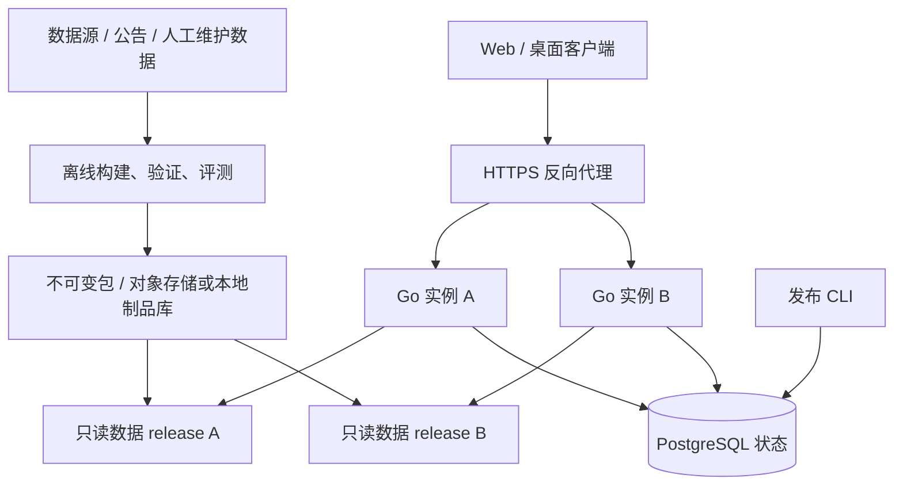

**ADR013：版本化数据、应用边界与可回滚发布**

日期：2026-09-08。状态：执行设计基线 v1，供其他 agent 按任务实施；本文不代表能力已实现。代码基准：`d988472`。上游依据：[修订评估](PRODUCT_ARCHITECTURE_REVIEW_2026-09-07.md)。任务状态以[交付计划](DELIVERY_PLAN.md)为准。

**总体决策**

保留 Go 模块化单体、静态预编译 Graph、确定性知识查询、Web/Wails/MCP 适配层。新增独立的数据构建/发布流程，以完整数据快照为一致性单位。第一阶段每个服务实例固定一个数据 release，以双实例实现发布和灰度；进程内多快照作为后续演进，不能每次请求重新编译 Graph。

服务器标准交付为 Docker Compose；systemd 完整离线包复用同一产物清单。服务器状态使用 PostgreSQL，覆盖会话、反馈、发布记录及多实例需要的额度状态。内存实现仅用于测试和显式单用户开发模式；不再为正式服务器先建一套 SQLite 后再迁移。Redis、独立知识微服务、消息队列和 Kubernetes 不在首期默认拓扑中，是否增加由容量验证决定。



图中的两个 Go 实例运行相同架构。数据灰度时使用相同应用镜像；应用升级时可以使用不同但互相兼容的镜像。单机双实例解决发布连续性，不能承诺主机故障时仍然可用。

**不可破坏的约束**

| 编号 | 约束 | 审查反例 |
| --- | --- | --- |
| A01 | 一个请求从 NLU 到 SSE 完成始终使用一个完整快照 | 每个节点重新读取 latest；新数据配旧词典 |
| A02 | metadata、knowledge、别名、画像、公告适用规则和派生索引共同验证 | knowledge 失败后继续发布新 metadata |
| A03 | 已发布数据包只读、不可覆盖，版本由清单标识 | 在生产目录运行清空再生成脚本；同名包被覆盖 |
| A04 | 游戏生效版本选择先于灰度分桶 | 新补丁上线后让 95% 当前查询继续用旧补丁事实 |
| A05 | 用户身份、会话所有权、数据 release 分别建模 | 信任任意 session_id，或把实验分组当作授权 |
| A06 | 双实例前共享会话；同会话保持 release，撤回时显式迁移 | 请求随机分配；切实例后声称记忆仍在但实际丢失 |
| A07 | 发布成功需要完整性、业务探针、版本匹配及失败恢复证据 | 只看到进程存活、HTTP 200 或 comp_count 非零 |
| A08 | LLM 只能整理证据与解释建议，不能补齐缺失事实 | 样本不足时调用模型猜胜率；Prompt 修饰旧版本事实 |
| A09 | 保留 v1 API 与桌面传输语义，先扩展后迁移 | 直接改 data 字段含义；桌面照搬 HTTP SSE |
| A10 | 在提交和 dev 验收证据齐全后才能完成任务 | 实现 agent 自报完成，或 CI 无该项仍算通过 |

**模块与接口所有权**

以下是计划新增/收敛的模块，不是当前仓库已有 API。实现 agent 可调整内部文件划分，但跨模块字段、错误码、兼容策略与依赖方向须同步到本 ADR 和对应任务卡。

| 模块 | 职责 | 约束 |
| --- | --- | --- |
| `tft/knowledge/contracts` | 现有领域查询/证据协议 | 不依赖 agent、数据库或传输实现；领域实体定义只维护一份 |
| `tft/release/contracts`（新增） | manifest、发布清单、scope、路由身份 | 发布控制与业务查询不互相复制版本结构 |
| `tft/knowledge` | 校验后的事实、索引和查询 | 保留两种 Store 的实现兼容，统一快照归属 |
| `tft/runtime`（新增） | 组装 RuntimeSnapshot 与加载状态 | 持有 knowledge、NLU 词典等；避免 knowledge 反向依赖 agent |
| `tft/agent` | 静态流程、NLU、证据组织、模型输出 | 通过注入访问本次快照；不直接读取磁盘别名或抓取网络数据 |
| `tft/app`（新增） | AppService、统一请求上下文/结果/生命周期 | HTTP、SSE、Wails 为适配器；不把 Gin Context 传入领域层 |
| `tft/session`、反馈存储实现 | 身份绑定、对话状态、反馈 | 接口与 PostgreSQL 驱动分开，禁止单个 JSONL 文件充当共享数据库 |
| `tft/release` 与 `cmd/tft-release`（新增） | 发布状态、实例能力、分桶、撤回、审计 | 发布写操作仅限受控 CLI/管理入口，默认不暴露公网管理 API |
| `scripts` | 来源适配、原始快照、标准化、构建报告 | 不承担线上问答请求；不写活动数据目录 |

依赖组装放在入口/runtime：knowledge 无须知道 NLU，runtime 负责把同一套实体词典注入 agent。MCP 使用同一领域协议，可继续独立运行；线上基础问答不因增加 MCP 适配而增加一次必经网络调用。

**DATA-01 必须固化的协议**

这些字段为设计要求，落地时由 DATA-01 提交正式 JSON Schema、Go DTO 和最小可加载样例。Python 构建器和 Go 读取器必须对同一样例执行兼容性测试；后续 agent 不各自发明 manifest。

| 协议 | 必需信息 | 语义 |
| --- | --- | --- |
| `DataScope` | game、set_id、game_patch、hotfix_revision、region、queue、locale、effective_at | 明确游戏/赛季/补丁/热修；中文语言不代表国服统计；热修标识可以为空但其语义必须明确 |
| `DataManifest` | data_release_id、schema_version、scope、reader_schema_range、files、sources、capabilities、builder_commit、built_at | schema 兼容范围与应用版本分开；生产 current 查询不接受未知适用补丁 |
| `SourceRecord` | provider、source_dataset_id/URL、source_version、fetched_at、raw_hash、统计范围和窗口 | 多来源分别记录；未知统计地区或段位保留 unknown，不能编造；未知补丁统计不能成为 current 排名证据 |
| `FileRecord` | relative_path、sha256、size、kind、entity_count | 拒绝越界路径、逃逸符号链接和缺失必需文件；发布包仅允许清单内文件 |
| `DeploymentManifest` | deployment_id、image_digest、app_commit、data_release_id、prompt_version、policy_version、model_config_version | 原子选择兼容组合；不将模型密钥写进清单 |
| `EvidenceEnvelope` | trace_id、release/scope、来源与证据 ID、freshness、sample_policy、warnings、capabilities | 回答、日志、反馈和评测共享版本身份；样本按事实记录，不把不同阵容 Count 相加当去重对局数 |
| `SessionRecord` | owner_id、session_id、state_revision、scope、assigned_release、experiment_id、context、expires_at | 对话每轮使用 CAS 或串行化，防止并发回答乱序覆盖；固定 release 可因撤回/补丁变化失效 |
| `RouteDecision` | request_id、subject_id、session_id、release_id、policy_revision、backend_id、expires_at | 由服务端决定；客户端只能回传签发结果，不决定目标实例或任意数据包 |

不同生成时间不应伪装成新的统计时间：明确区分 fetched_at、stats_window_end、effective_at、built_at。包内容 hash 对不可变负载定义，构建 run ID/时间记录单独保存，避免哈希自引用；同输入重复构建的语义内容必须可复现。

统计资格统一由 `SamplePolicy` 决定，并由版本清单记录：主推荐与 Meta 补充不能执行互相矛盾的样本过滤。原始低样本事实可保留，作为学习资料显示不确定性；是否可进入排名、可用哪些指标必须由业务规则给出，不由 Prompt 临时判断。

**请求生命周期与兼容**

目标顺序：识别身份 → 校验会话所有权与请求限制 → 确定有效 scope → 获取/创建固定 release 分配 → 路由到具备该 release 的实例 → 获取完整快照 → NLU/检索/生成 → 持久化结果与反馈 → 结束。SSE 中途切换控制清单不会改变正在运行的快照。

内部统一 AppRequest/AppResult。JSON v1 的现有 `data` 字段保留原语义，通过新增可选字段提供 metadata/evidence；完整答案的请求方式与返回协议由 CORE-02 写明并做兼容测试，禁止静默把 Context 替换成新结构。SSE 保留既有 token/error/done 事件语义，添加客户端可忽略的 metadata/evidence 事件；业务 token 不因新增元事件被统计两次。Web 与 Wails 分别编码传输，共用应用服务和证据协议。

默认一实例一 release，加载失败不进入 ready。可选能力不足可以用 manifest 声明的显式降级模式运行；必需知识失败不能偷偷退为 data-only。现有低层 Reload 应修复为全部成功才替换，并退出生产发布入口；首期通过新实例加载完整快照发布，不能声称低层 Store 重载已经更新 Agent 缓存。实时多快照由 EVOL-04 单独实现。

服务器身份使用可撤销的内测访问凭证或服务端匿名凭证，绑定 session 所有权。浏览器持久化凭证通过安全会话机制处理，不要求把长期模型/管理员密钥存进 localStorage。CSRF/跨域策略与所选凭证载体一致。桌面本地模式为显式单用户模式；桌面连接服务器仍走同样的授权/额度规则。

统一配置对象读取所有 provider 的端点、超时与密钥引用，并覆盖现有 ARK_BASE_URL；模型密钥不进入日志。请求体、输入长度、并发、用户预算与总成本预算分别限制。上线双实例前，集中额度要能保证两个实例同时请求也不超放；取消/超时释放并发槽，模型重试有预算且只对适合重试的错误执行。

**第一期灰度路由实现基线**

保留一个公共 HTTPS 入口。两个应用实例都包含轻量 `ReleaseRouter`；新请求进入当前入口实例后，从共享会话/发布记录取得 RouteDecision。若目标 release 在本实例则执行；否则经内网转发到登记为 ready 的另一个实例。转发仅一跳，目标地址来自实例注册表，不接受客户端指定 URL。

内部请求携带短时、可校验且绑定 request/session/release 的路由信息；应用端校验原始身份与额度预留，不得通过公开头绕过认证。复用同一 request/trace，配额与费用只记一次。转发传播取消信号，按 SSE 逐块 flush；防转发环、伪造内部头和双重计费列为强制集成验收。OPS-04 负责这条路由，CORE-04 提供预算/身份接口。

该选择使第一期不必增加独立网关服务。它增加候选请求的一次内部转发；PERF-01/OPS-05 应测量成本。未来若入口成为瓶颈，可在 EVOL-06 中把同一接口提取到网关，不能在首期同时维护两套分桶策略。

分桶先限定有效 scope，再计算稳定 subject 的实验桶号。分配结果持久化到会话；提高比例默认影响新会话。已有会话在 release 仍有效时保持原包，不能按每次请求重新随机。游戏切补丁或 release revoked 时，原分配失效，迁移到同地区当前有效包并清除/标注旧上下文；历史复盘请求显式使用历史 scope。

双实例只有两个槽位，旧槽不能仅因“流量已全量切换”就关闭：它可能仍服务固定到旧 release 的会话。正常退役先停止新会话分配，再等待已配置的会话保留上限；到期后在下一轮请求前，以 CAS 将剩余会话迁移至兼容稳定 release，提示版本变化并重新验证上下文。在途请求仍按排空策略处理；迁移完成且活动请求归零后，才将旧槽注销、停止并允许下次部署复用。连续第三次发布必须先检查槽位可用，不得覆盖仍被引用的包。离线历史包保留不代表常驻进程必须无限保留历史会话。

**发布状态机与失败语义**

```text
BUILDING → VALIDATED → READY → CANARY → STABLE → RETIRED
    └失败     └失败      └失败     └撤回       └撤回
       FAILED（未接流）           REVOKED（禁止新分配）
```

构建状态与流量状态分别持久化，不能靠目录名隐式判断。对象/磁盘包先写成功并验 hash，再在数据库事务中更新控制清单。发布策略带递增 revision、幂等操作 ID、操作者与原因。并发 promote/rollback 使用 CAS 拒绝过期 revision；回滚也产生新 revision，不把控制版本倒退。实例上报具体 release/schema 与 ready，未加载候选的实例不能接候选流量。

代码镜像与数据独立发布；允许的组合必须在部署清单中通过兼容性检查。迁移数据库采用先扩展后收缩的兼容策略，使旧实例在排空期间能继续读取共享状态。数据库破坏性回滚不能冒充普通应用回滚。

| 故障 | 必须发生的行为 |
| --- | --- |
| 抓取超时、空值、schema 变化 | 候选失败；记录来源问题；不覆盖活动包 |
| 包下载不完整、hash 不符 | 拒绝加载；候选不 ready；仍适用的稳定包继续服务 |
| 控制端暂时不可用 | 使用最后验证且未超过租约/有效期的路由；租约到期或当前补丁不可确认时拒绝相关动态能力 |
| 候选错误/性能异常 | 停止新分配；撤回并恢复同补丁兼容包；对失效会话明确迁移 |
| 游戏新补丁已生效，统计未就绪 | 当前补丁基础事实模式，排名标记积累中；旧统计只供历史对比 |
| SSE 正在输出时普通发布 | 在途继续用原快照，排空后退出；不向客户端伪造 done |
| release 严重错误需紧急撤回 | 新请求禁止使用；按撤回策略取消在途/标识失效，保留审计与可解释错误 |
| PostgreSQL 暂时不可用 | 不绕过授权/额度或捏造持久成功；按能力返回可重试错误，记录持久化失败 |

数据可信度与服务健康分开：存活探针只证明进程可响应；ready 验证真实快照与必需依赖，报告 app/data/schema；上游 LLM 状态用受控合成检查或近期错误指标，不在每次健康探测时调用模型。基础事实降级模式的 ready 与 capability 要能让代理和 UI 区分。

**运行、评测与回滚门槛**

发布至少携带确定性数据验证、代表性事实评测、版本兼容、会话跨实例、SSE 排空、取消与回滚演练的证据。真实模型评测独立标注模型配置、样本量和成本，不以关键词/回答不重复代替正确性。

指标按稳定/候选和 release 维度比较：错误、事实错误、首次有用信息时间、首 token、完成耗时、LLM 次数/token/成本、空结果、持久化失败、ready 延迟。trace/session ID 不作为高基数时序标签。阈值、观察窗口和最低样本量由 OBS-01 基线与 OPS-04 策略共同固化；样本不足不能自动 promote。评估中的 1 个百分点/20% 仅作待校准初值。

部署顺序固定为：构建确定镜像与数据包 → 启动空闲槽 → 验证快照和共享数据库兼容 → 小流量 → 指标观察 → 全量 → 排空 → 保留可回退产物。安装配置前置校验，独立非 root 用户、只读代码/知识与可写状态目录；脚本任何关键失败必须返回非零。Linux/macOS 打包差异须分别验证，不依赖个人路径。

**后续演进与修改方式**

文本学习/复盘状态成熟后，提取可测试的 DecisionPolicy，再接图片复盘输入。OCR 是输入适配器，输出带置信度和待确认实体的结构化状态，不能绕过知识层。legacy 退场以调用统计、兼容通知和回归为条件。进程内多快照、跨主机高可用等由专门任务及触发条件启动。

改变 A01–A10、共享字段、存储选择、路由方式或兼容策略时，实施 agent 提交设计差异、迁移和测试影响，由统筹审查后更新本文件；这属于技术协调，不要求为日常实现细节反复向用户询问。当前方案以小 PR 顺序落地，禁止在一项任务中顺带重写所有 Store/Graph/前端。
